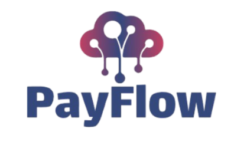

<h1 align="center"> TEAM PAYFLOW <h1>

  

## 📋 Table of contents
  - [Description](#description)
  - [Documentation](#docs)
  - [Technologies](#technologies)
  - [Collaborators](#collaborators)

## 🔍 Description 

 This is an online banking system that is our intake on the finance challenge project. 

## 📃 Documentation 
### Documentation
[Documentation](https://github.com/codingburgas/finance-challenge-payflow/blob/main/Documents/PayFlow-doc.docx)

### Presentation
[Presentation](https://github.com/codingburgas/finance-challenge-payflow/blob/main/Documents/PayFlow's%20presentation.pptx)

## 🖥️ Technologies used 
### IDE & version control system:

### Programming languages & third-party libraries:

### Tools used for documantation & presentation:

### Design

## 🧑 Collaborators 

<a href="https://github.com/RDNikolov22">Rostislav Nikolov</a> - Scrum Trainer

<a href="https://github.com/PDDineva22">Polina Dineva</a> - Back-end Developer

<a href="https://github.com/YTGeorgieva22">Yoana Georgieva</a> - Front-end Developer

<a href="https://github.com/ZSVladkov22">Zarko Vladkov</a> - Front-end Developer

